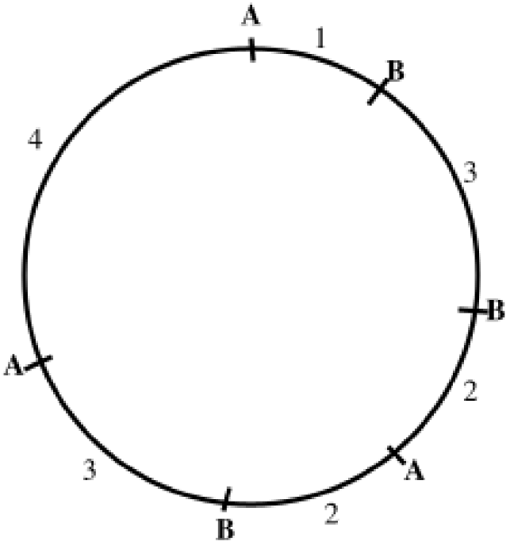

# Dna & Gel Electrophoresis Conversion
Algorithm to get the associated gel electrophoresis of a give DNA segment or determine what DNA segment could have created a given gel electrophoresis

## Introduction

The purpose of my program is to help biologists deduce what gel electrophoresis would be produced by cutting a DNA segment with given enzymes at given points or where enzymes cut a given DNA segment given its resulting electrophoresis. Given a representation of DNA cut by given enzymes, the program outputs the resulting electrophoresis; one DNA segment always produces the same electrophoresis. Given a representation of an electrophoresis, it outputs one of many possible ways the given enzymes could have cut the DNA to produce that electrophoresis; one electrophoresis could come from multiple DNA segments. My program works for both linear and circular DNA segments, and also enables users to generate random segments to analyse.

## Background

In my program, DNA is formatted so that “-A---B--B---A--A-” represents a linear DNA segment that is 12 kilobases long (12 dashes). If a biologist ran an electrophoresis on the above segment with those enzymes, it would produce the below electrophoresis. The DNA was cut 3 times by enzyme A, and if only enzyme A was applied to the segment, it would’ve produced 4 fragments of sizes 1, 8, 2, and 1 kilobases; this is represented by column A of the electrophoresis, which tells us that when enzyme A is individually applied, it produces 2 fragments of size 1 kilobase, 1 fragment of size 2 kilobases, and 1 fragment of size 8 kilobases. It was cut 2 times by enzyme B, and if only enzyme B was applied, it would’ve produced 3 fragments of sizes 4, 2, and 6 kilobases; this is represented by the B column of the electrophoresis. When enzymes A and B are applied, it produces 6 fragments of sizes 1, 3, 2, 3, 2, and 1 kilobases; this is represented by the A+B column of the electrophoresis.

| A | B | A+B | Scale |
| :---: | :---: | :---: | :---: |
| 2 |   | 2 | 1 |
| 1 | 1 | 2 | 2 |
|   |   | 2 | 3 |
|   | 1 |   | 4 |
|   |   |   | 5 |
|   | 1 |   | 6 |
|   |   |   | 7 |
| 1 |   |   | 8 |
|   |   |   | 9 |
|   |   |   | 10 |
|   |   |   | 11 |
|   |   |   | 12 |

Similarly, “A-B---B--A--B---A---->” represents a circular DNA segment that is 15 kilobases long (15 dashes); the “>” at the right end indicates that the left and right end are thus joined:



If a biologist ran an electrophoresis on the above segment with those enzymes, it would produce the below electrophoresis. The DNA was cut 3 times by enzyme A, and if only enzyme A was applied to the segment, it would’ve produced 3 fragments of sizes 6, 5, and 4 kilobases. It was cut 3 times by enzyme B, and if only enzyme B was, it would’ve produced 3 fragments of sizes 3, 4, and 8 kilobases. When enzymes A and B are, it produces 6 fragments of sizes 1, 3, 2, 2, 3, and 4 kilobases.

| A | B | A+B | Scale |
| :---: | :---: | :---: | :---: |
|   |   | 1 | 1 |
|   |   | 2 | 2 |
|   | 1 | 2 | 3 |
| 1 | 1 | 1 | 4 |
| 1 |   |   | 5 |
| 1 |   |   | 6 |
|   |   |   | 7 |
|   | 1 |   | 8 |
|   |   |   | 9 |
|   |   |   | 10 |
|   |   |   | 11 |
|   |   |   | 12 |
|   |   |   | 13 |
|   |   |   | 14 |
|   |   |   | 15 |

## Steps to Use: Inputs & Outputs

First, it prompts the user, asking which functionality of the program they want to use:

```
Please input:
  1 to analyse a given linear DNA segment;
  2 to analyse a given circular DNA segment;
  3 to analyse a given electrophoresis track;
  4 to analyse a randomly generated DNA segment;
  5 to perform a pre-arranged test of all functionalities.
```

Note that if the user’s input is invalid at any point in the program, it prompts them to try again.

If the user presses _1_ or _2_, they are prompted to input a linear or circular DNA segment. The program then outputs their DNA segment, the length of the segment, the total number cuts made by all enzymes on the segments; the electrophoresis produced by applying those enzymes to the segment, the total number of fragments produced when all those enzymes are simultaneously applied; the number of cuts and fragments from each enzyme being individually applied.

If the user presses _3_, they are prompted to input the maximum number of kilobases on their electrophoresis scale; the names of all the enzymes used; the length of the fragments produced by individually applying each enzyme and, if more than one enzyme was used, the length of the fragments produced by simultaneously applying the enzymes. If the user inputted the description of an fake electrophoresis, one that could not have resulted from any DNA segment, the program informs them that it was invalid; otherwise, it outputs one possible DNA segment that could have made the inputted electrophoresis, the electrophoresis, enzymes, and all associated statistics.

If the user presses _4_, they are prompted to input the maximum number of enzymes; the minimum and maximum number of fragments and cuts; the minimum and maximum fragment size that they would like their randomly generated DNA segment to have. The program then outputs a fitting random segment, its resulting electrophoresis, enzymes, and all associated statistics.

If the user presses _5_, the program performs a pre-arranged set of tests of all of its functionalities that helped me, the programmer, during the debugging process. It outputs the DNA segment, electrophoresis, enzymes, and all associated statistics that correspond to 6 predetermined inputs.

## Algorithms

My program consists of 2 main algorithms: a fairly straightforward one to find the electrophoresis that would be produced from a given DNA segment; a more complicated one that I came up with to find one possible DNA segment that could have produced a given electrophoresis. There are also many smaller algorithms that analyse either the DNA segment or electrophoresis, depending on what the user inputted, and determine various statistics describing them by analysing the various representations of the objects and performing simple arithmetic.

**DNA → Electrophoresis Object Algorithm:**

First, the program creates a column (1D integer array) for the scale of the electrophoresis, where the length of the segment is the maximum scale value.

Then, it creates a table (2D integer array) representing the electrophoresis, where each row represents the fragments each enzyme made when individually applied. If only one enzyme was used, the table only has 1 row; otherwise, it has rows for each enzyme and an additional row representing the fragments all enzymes made when simultaneously applied. For each individual enzyme row, the program loops through the representation of the DNA segment (ArrayList of

Integers, representing fragment sizes, and Strings, representing enzyme cuts), adding the lengths of all previous fragments until it finds a cut made by that enzyme, at which point it increments the value of the row at that fragment size and resets the current fragment length. Once the iteration is completed, there will be a fragment size that hasn’t yet been accounted for in the row. If the input was a linear DNA segment, the program will then account for that last fragment. If it was a circular DNA segment, it must then circle back to the start of the segment and add to that fragment size until it finds the first occurrence of that enzyme’s cut, at which point it can account for that fragment size and delete any extraneous fragment size that may have resulted from this circling back. After accounting for all the fragment sizes produced by individual enzymes, if there were multiple enzymes, the program loops through the representation of the DNA segment and increments the value of the row at that fragment size for all sizes. To format this table as an electrophoresis (each enzyme corresponds to a column), the program then transposes the matrix.

Next, to gather statistics on how many fragments were produced by applying each individual enzyme and all the enzymes simultaneously to the segment, the program iterates through each column of the table and sums the number of fragments that enzyme made.

**Electrophoresis → DNA Object Algorithm:**

Since it is unclear whether the electrophoresis came from a linear or circular DNA segment, the program tries to find first a linear segment that could have produced the given electrophoresis, and, if that fails, then a circular segment. If the program fails to find either a linear or circular segment that could have produced the given electrophoresis, then the electrophoresis was fake.

In trying to find either a linear or circular segment that fits the given electrophoresis, the program first determines the length of the DNA by iterating through the last column of the electrophoresis table and adding together the fragment sizes produced by applying all enzymes simultaneously.

Then, the program checks if the electrophoresis only had one enzyme (but ensures that enzyme wasn’t only used once while currently trying to construct a linear segment, because that is a different case). If so, it constructs a String representation of the segment by alternating between adding fragments of the given size and the enzyme cut. The program then iterates through this String representation to create an ArrayList representation of the segment, and is finished.

If the electrophoresis didn’t have only one enzyme, the program then checks if it is trying to construct a circular DNA object with multiple enzymes. If so, it checks if each enzyme made a single cut on the segment by counting the number of fragments in each column of the electrophoresis and ensuring that it is equal to the length of the DNA. If the program finds that each enzyme made a single cut on the circular segment, it constructs a String representation and decodes it into an ArrayList, as described above, and is finished.

Next, the program checks that the number of fragments and cuts that the electrophoresis registered corresponds to the numbers registered from the sum of the enzymes to ensure that the electrophoresis is valid.

If so, the program then makes a matrix of integer arrays. Each row in the matrix corresponds to an enzyme, and each array within the row holds a shuffled permutation of the fragment sizes produced by individually applying that enzyme. In other words, each row holds all possible permutations of the fragment sizes produced by individual enzymes. If multiple enzymes were used, the first row holds all possible permutations of the fragment sizes produced by all enzymes.

The program then loops through all possible combinations of the enzyme permutations in the matrix. For permutation in each combination, the program attempts to construct a String representation of a DNA segment cut by a single enzyme so that the fragment sizes are in the order of the given permutation. If the program is currently trying to construct a circular DNA segment, it will also iterate through all possible shifts, in which the right end of the representation is brought to the left, produced by single enzymes to represent their continuity. It then attempts to add these representations of the DNA segments cut by single enzymes using character-by-character comparisons to determine if there is a way to make them match the representation created by the permutation for all enzymes. If so, that representation is one possible DNA segment that could have produced the given electrophoresis, and the program is finished. If, after looping through all possible combinations, the program does not find one that fits the criteria, it knows that there is no possible DNA segment of that type (linear or circular, depending on what it is trying to construct) that could produce the given electrophoresis.
